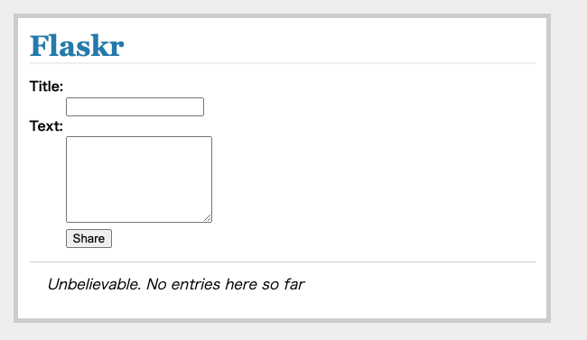

# tutorial

## このアプリについて

ブログ記事を管理するためのアプリ

※Flask チュートリアルの練習用リポジトリ

https://study-flask.readthedocs.io/ja/latest/02.html

## Usage(使い方)
### requirements.txtについて
- ブログアプリに必要なライブラリをインストールするためのテキストコード
```
$ pip install -r requirements.txt
```
をターミナルで起動しインストール

### manage.pyについて
- flaskrというアプリを起動し実行するためのファイル


### flaskr/__init__.pyについて
- ブログアプリを作成するため、データベースを仕様できるようにする初期設定


### flaskr/config.pyについて
- SQLiteというデータベースを使い、ファイル名を指定してデータベース管理する。また、セッション情報を暗号化するためのキーの設定。
※実際に運用する場合は変更が必要。


### flaskr/models.pyについて
- ブログの記事（データ）を格納するデータベースを作成

### flaskr/views.pyについて
- ページを表示する。また、記事の情報をデータベースに追加・格納する機能を持つ。
- 関連コード・・・show_entries.html,layout.html,style.css

## 動作確認
```
python3 manage.py
```
http://127.0.0.1:5000 をブラウザで開いて動作を確認。

## 画面レイアウト



## その他
- セッション情報を暗号化するためのキーの設定について、実際に運用する場合は変更が必要。